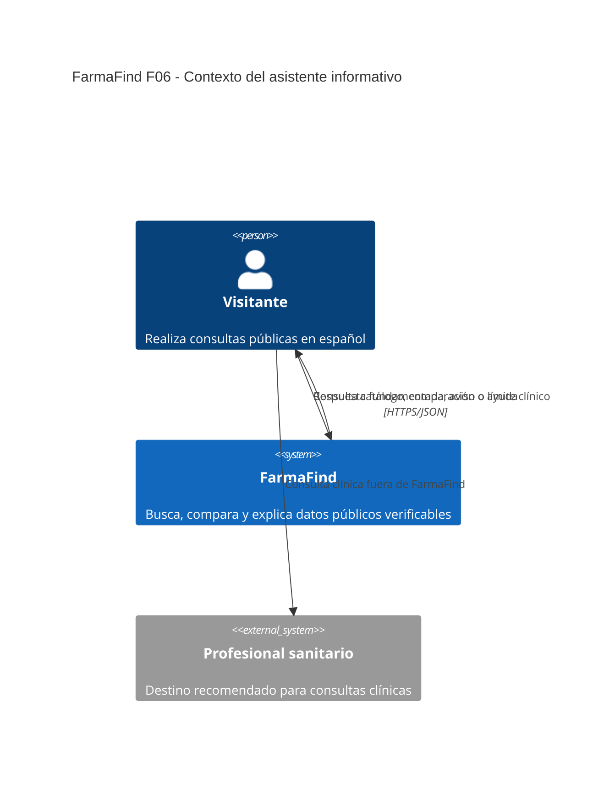

# C4 F06 — Contexto

```mermaid
C4Context
  title FarmaFind F06 - Contexto del asistente informativo
  Person(visitor, "Visitante", "Realiza consultas públicas en español")
  System(farmafind, "FarmaFind", "Busca, compara y explica datos públicos verificables")
  System_Ext(professional, "Profesional sanitario", "Destino recomendado para consultas clínicas")
  Rel(visitor, farmafind, "Consulta catálogo, comparación o ayuda", "HTTPS/JSON")
  Rel(farmafind, visitor, "Respuesta fundamentada, aviso o límite clínico")
  Rel(visitor, professional, "Consulta clínica fuera de FarmaFind")
```

No existe relación con un proveedor IA externo en F06.
